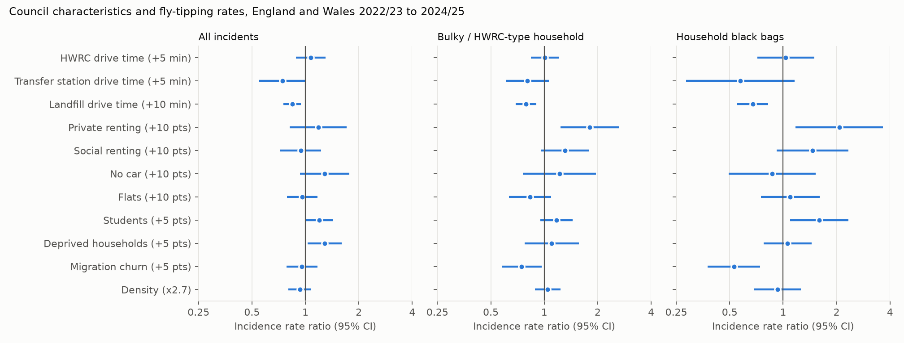
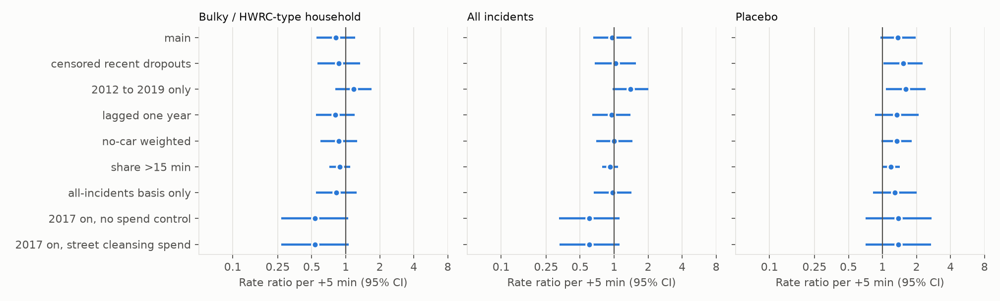
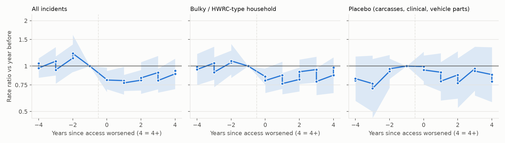
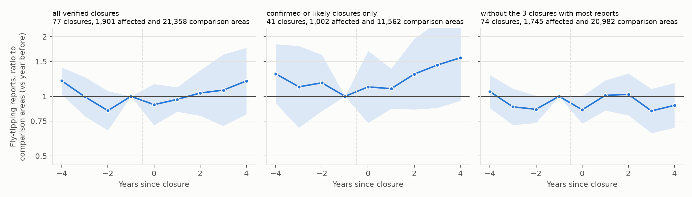
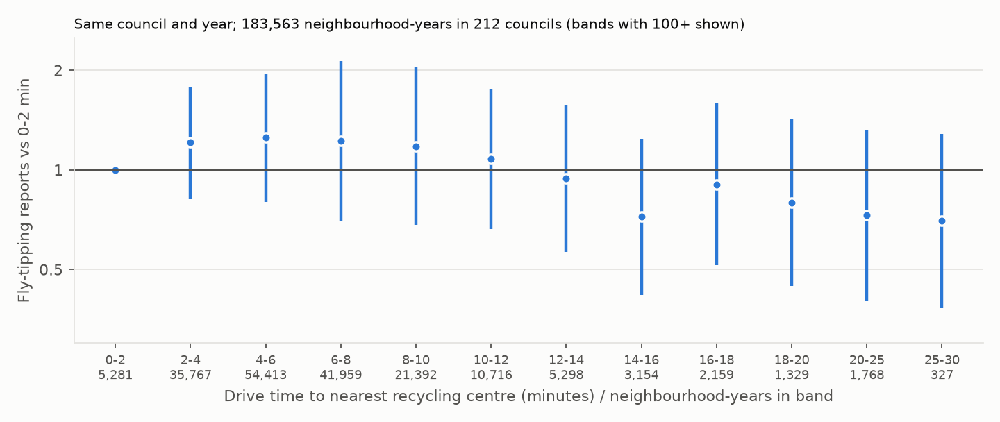
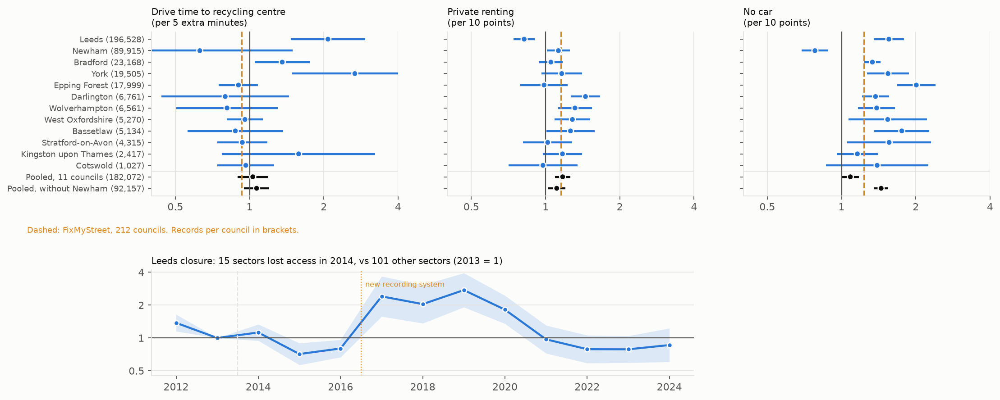
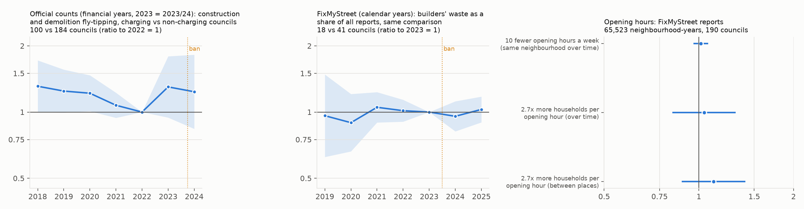

# What drives fly-tipping? First results

Council-level analysis of recorded fly-tipping in England and Wales, 2012/13 to
2024/25, guided by the hypotheses in [`research_brief.md`](research_brief.md).
Code is in `src/` (see the [README](../README.md)); estimates are in
`outputs/model_results.csv` and `outputs/event_study.csv`.

## Summary

1. **Access to household waste recycling centres (HWRCs) shows no reliable link
   to recorded fly-tipping.** Across councils, once housing and deprivation are
   accounted for, a council whose residents live 5 minutes further from their
   nearest HWRC has essentially the same fly-tipping rate (all incidents: rate
   ratio 1.07, 95% CI 0.89 to 1.30; bulky household waste: 1.01, 0.84 to 1.21).
   Within councils over time, estimates swing in sign between periods and the
   placebo waste types move too, so they cannot be read as causal in either
   direction.
2. **Housing is the strongest correlate, and it matches the type of waste.**
   Each extra 10 percentage points of households renting privately goes with
   about 80% more bulky household fly-tips (1.80, 1.24 to 2.62) and about twice
   as many household black-bag fly-tips (2.07, 1.17 to 3.65). Student share is
   also linked to black bags (1.60 per 5 points, 1.10 to 2.33). This fits the
   brief's tenant-turnover and communal-bin explanations.
3. **Deprivation goes with more fly-tipping overall** (1.29 per 5 points of
   households deprived in 2+ dimensions, 1.03 to 1.60), and car-less households
   with more construction and tipper-sized incidents.
4. **The raw pattern is the opposite of the access hypothesis.** Without
   covariates, councils further from HWRCs record *less* fly-tipping (0.74 per
   5 min, 0.60 to 0.92), most likely because remote councils are rural, and rural
   councils record less (more private land, less proactive cleansing). Landfill drive time keeps a negative association even with
   covariates, which most likely reflects the same rurality and recording effects.
5. **The main limits are measurement:** official counts reflect council
   recording effort as much as dumping, and site disappearances in the Environment
   Agency returns are not reliable evidence of closure (see Data quality).

## Data and design

### The two fly-tipping records

| | Official council counts | FixMyStreet reports |
|---|---|---|
| Who records it | Council staff, for every incident the council deals with, whether a resident reported it or a crew found it; sent yearly to Defra (England) or the Welsh Government | Members of the public, through mySociety's website and app; each report is passed to the council |
| What one record is | A yearly total for a whole council; individual incidents are not published | One report from one person, with a date |
| Location | None below the council. The only "where" is the type of land (highway, footpath, back alley, council land, agricultural, private or residential, and so on) | An exact point, so each report can be placed in a neighbourhood |
| Type of waste and size | Recorded by officers in fixed categories (black bags, bulky household, construction, green waste, tyres and others; single bag to tipper lorry load) | Not recorded in a standard way; we sorted reports by keywords in their text, which gave a waste type for 57% |
| How many | 13,222,032 incidents, 2012/13 to 2024/25, 318 councils | 904,027 reports in England and Wales, 2012 to 2025; 674,572 in the neighbourhood models (212 councils) |
| What it misses | Fly-tipping on private land the owner clears, including most on farms; councils differ in how thoroughly they record, and some count only what the public reports | Most fly-tipping: about 1 in 20 of the incidents councils record, shaped by who chooses to report through this website |
| What we use it for | Comparing councils, and the type of land waste was dumped on | Comparing neighbourhoods within the same council and year, where recording and website use cancel out |

Councils hold the location of each incident in their own systems, and a few
publish it as open data (York, Leeds, Bradford, Calderdale and Bassetlaw; see
DATASETS.md). Those could be used to check the FixMyStreet neighbourhood results.

### Variables and models

- **Outcome:** incidents reported by councils to WasteDataFlow (Defra for England,
  StatsWales for Wales), harmonised to December 2025 council boundaries: 318
  councils, 13 years. Split by waste type, size and land type (groupings in
  `src/build_analysis.py`).
- **HWRC access:** drive time from each of 35,672 neighbourhood (LSOA)
  population-weighted centroids to the nearest HWRC over OS Open Roads, using
  nominal free-flow speeds by road class, then population-weighted per council.
  English HWRCs come from each year's EA Waste Data Interrogator (705 sites in
  2012, about 659 in 2024) and Welsh ones from the current NRW permit register.
  Times are a consistent relative measure, not realistic journey times (no
  congestion; median about 6 minutes).
- **Covariates:** Census 2021 tenure, car availability, flats, students and
  household deprivation; ONS mid-year population and migration churn; population
  density; drive time to the nearest landfill and waste transfer station; council
  recording basis (all incidents vs public-reported only); street cleansing
  spending (MHCLG revenue outturn, 2017/18 onward).
- **Models:** Poisson pseudo-maximum likelihood with a log-population offset,
  so coefficients are rate ratios. Standard errors are clustered by waste disposal
  authority (county in two-tier areas, joint authorities in Greater Manchester,
  Merseyside and London).
  - *Between councils:* 2022/23 to 2024/25 pooled, with region and year effects
    (950 council-years).
  - *Within councils:* England 2012/13 to 2024/25, with council fixed effects and
    region-by-year effects, so fixed council traits and national shocks (landfill
    tax, fixed penalty reforms, Covid) are absorbed (about 3,800 council-years).
  - *Event study:* 30 councils whose average drive time first rose by at least a
    minute in one year, against councils whose access never moved by more than
    half a minute.
  - *Placebo outcome:* animal carcasses, clinical waste and vehicle parts, which
    HWRC access should not affect.

## Results

### Which councils have more fly-tipping?

All coefficients come from one model per outcome, so each is net of the others.
Key estimates (rate ratio, 95% CI):

| Driver | All incidents | Bulky household | Household black bags | Construction / demolition | Placebo |
|---|---|---|---|---|---|
| HWRC drive time (+5 min) | 1.07 (0.89 to 1.30) | 1.01 (0.84 to 1.21) | 1.03 (0.71 to 1.50) | 0.97 (0.75 to 1.24) | 0.91 (0.63 to 1.31) |
| Private renting (+10 pts) | 1.18 (0.82 to 1.71) | **1.80 (1.24 to 2.62)** | **2.07 (1.17 to 3.65)** | 1.13 (0.64 to 2.00) | 1.04 (0.55 to 1.98) |
| Students (+5 pts) | 1.19 (1.00 to 1.43) | 1.17 (0.95 to 1.44) | **1.60 (1.10 to 2.33)** | 0.83 (0.60 to 1.15) | 1.18 (0.77 to 1.81) |
| Deprived households (+5 pts) | **1.29 (1.03 to 1.60)** | 1.10 (0.77 to 1.56) | 1.06 (0.78 to 1.44) | 0.95 (0.56 to 1.62) | 1.52 (0.98 to 2.37) |
| No car (+10 pts) | 1.28 (0.93 to 1.76) | 1.22 (0.76 to 1.96) | 0.87 (0.49 to 1.53) | **2.15 (1.16 to 3.97)** | 1.09 (0.59 to 2.04) |
| Landfill drive time (+10 min) | **0.84 (0.75 to 0.94)** | **0.79 (0.69 to 0.90)** | **0.67 (0.55 to 0.82)** | **0.80 (0.69 to 0.92)** | 0.93 (0.74 to 1.16) |

Bold: 95% CI excludes 1.

Reading the pattern:

- **Housing tracks waste type.** Private renting and students line up with
  household black bags and bulky household items, which is what end-of-tenancy
  clear-outs and communal bins would produce. They do not predict
  construction or placebo waste. Migration churn turns negative once tenure and
  students are in the model. It overlaps heavily with both, so it should not be
  read on its own.
- **HWRC access is flat across every outcome**, including the bulky
  household items people would take to an HWRC, and the confidence intervals rule
  out large effects (more than about +30% per 5 minutes).
- **Landfill distance** is negative for every household outcome but not the
  placebo, the reverse of what a "too far to dump legally" story predicts. The
  likely reason is that landfills sit in rural areas, where councils record less
  (more private land, less proactive cleansing).

### Does fly-tipping change when HWRC access changes?

Within councils the estimates are imprecise and unstable:

| Specification | All incidents | Bulky household | Placebo |
|---|---|---|---|
| Main, 2012/13 to 2024/25 | 0.96 (0.65 to 1.42) | 0.82 (0.55 to 1.21) | 1.37 (0.96 to 1.97) |
| 2012/13 to 2019/20 only | 1.40 (0.97 to 2.02) | 1.17 (0.81 to 1.69) | **1.60 (1.07 to 2.40)** |
| 2017/18 on, with street cleansing spend | 0.61 (0.33 to 1.12) | 0.54 (0.27 to 1.06) | 1.38 (0.71 to 2.70) |

The event study tells the same story differently: recorded fly-tipping in the 30
"worsening" councils is about 20% lower in the years after access drops, with
flat pre-trends, but the placebo series is also below 1.

**Interpretation.** A genuine behavioural response to HWRC access should raise
bulky household fly-tipping and leave the placebo flat. Instead the sign flips
between periods, the placebo responds about as much as the target outcomes, and
tipper-lorry incidents (which HWRCs cannot take) show the largest "effects". The
within-council variation is therefore picking up something other than dumping
behaviour: changes in council recording or service levels that coincide with
site changes, and noise in the site data (below). Controlling for street cleansing
spending changes nothing, so cleansing budgets are not the whole story. The
honest conclusion is that this panel cannot identify the causal effect of HWRC
access; it can only say that large effects are not visible.

## Data quality issues found

1. **Sites vanishing from EA returns are not closures.** Both Trafford HWRCs
   (Chester Road and Woodhouse Lane) are missing from the 2023 to 2025 Waste
   Data Interrogator but are open
   ([Recycle for Greater Manchester](https://recycleforgreatermanchester.com/recycling-in-your-area/trafford/)).
   Gaps between appearances are filled, and a sensitivity check treats sites
   last seen from 2021 as still open, but the yearly HWRC list remains noisy.
   This biases within-council estimates towards zero and adds spurious events.
2. **Recording effort.** Councils that record "all incidents" against
   "public-reported only" are flagged, but effort also varies within each group.
   Rural councils appear to record less, which would explain the negative
   raw association between remoteness and fly-tipping.
3. **Wales** has no HWRC history (current NRW register only), so Welsh councils
   contribute to the between-council model only. Newport has no HWRC in the NRW
   permit data.
4. **DIY charges, booking systems and opening hours** (the brief's H2 and the
   strongest natural experiment, the England DIY-charge ban from 31 December 2023)
   are not in any public dataset found, so are untested.

## Neighbourhood analysis with FixMyStreet reports

### What the data is and how it was used

FixMyStreet is a website and app run by the charity mySociety where members of the
public report street problems, which are passed to the council. Each report has a
location, a date and a category chosen by the council (for example "Flytipping",
"Fly-tip Small - Less than one bag", "Dumped rubbish"). We downloaded every report
in 48 fly-tipping categories and 26 litter categories through mySociety's public
Open311 interface (2012 to October 2025), and placed each report in its
neighbourhood. A neighbourhood here is an ONS Lower Layer Super Output Area
(LSOA): a small area of about 1,500 to 1,700 residents. There are 35,672 in
England and Wales.

| Step | Fly-tipping reports |
|---|---|
| Downloaded | 915,941 |
| Inside England and Wales | 904,027 |
| In complete years 2012 to 2024 | 721,733 |
| In council-years with at least 50 reports (used in the models) | 674,572 |

The 50-report threshold drops council-years where FixMyStreet is barely used,
because comparing neighbourhoods needs enough reports to compare. The models use
183,799 neighbourhood-years from 27,056 neighbourhoods in 212 councils. Litter
reports are much rarer: 66,416 reports in 22 councils, so litter results are less
reliable.

**How FixMyStreet compares with official counts.** In a typical council-year,
FixMyStreet reports equal about 5% of the incidents the council records
officially (middle half of council-years: 2% to 12%; 1,278 council-years with 50
or more reports). In 2024, 118,560 FixMyStreet reports compare with 1,305,724
official incidents. The two only loosely agree (correlation of 0.38 between their
logarithms), so FixMyStreet is a partial view: it captures what members of the
public choose to report through this one channel.

**The comparison.** For each council and year separately, we compared its
neighbourhoods with each other: do neighbourhoods further from a recycling centre
report more fly-tipping per resident than neighbourhoods closer by, when their
housing is similar? Comparing only within a council and year removes everything
that differs between councils or years, including how much a council uses
FixMyStreet and how it records incidents. That was the main weakness of the
council-level analysis.

The drivers in these models, all measured per neighbourhood:

- **Drive time to the nearest recycling centre**, in minutes, as in the council
  analysis, for each year.
- **Private renting**: the share of households renting from a private landlord or
  letting agency (Census 2021).
- **No car**: the share of households without a car or van (Census 2021).
- **Population density**: residents per square kilometre.
- **Rural**: whether ONS classes the neighbourhood as rural rather than urban.

Results are rate ratios: 1.20 means 20% more reports per resident; 0.80 means 20%
fewer; 1 means no difference.

### Results

**1. Within the same council and year, neighbourhoods further from a recycling
centre do not report more fly-tipping.** A neighbourhood 5 minutes further away
has a rate ratio of 0.93 (95% confidence interval 0.81 to 1.07), allowing for
housing and car ownership. Looking at distance bands rather than a straight line,
neighbourhoods 20 minutes or more away report fewer fly-tipping incidents than
those under 5 minutes away (0.67, 0.48 to 0.93), not more.

**2. Private renting and car-less households are linked to more fly-tipping, as
in the council analysis.** Each extra 10 percentage points of households renting
privately goes with 15% more fly-tipping reports (1.15, 1.07 to 1.24). Each extra
10 points of households without a car goes with 23% more (1.23, 1.11 to 1.36).
The same two drivers are linked to litter reports (1.13 and 1.21 per 10 points).

**3. Rural neighbourhoods report about as much fly-tipping per resident as urban
ones in the same council** (1.14, 0.81 to 1.60). In the official council data,
councils further from recycling centres, which are mostly rural, record less
fly-tipping. Comparing neighbourhoods within councils, that difference does not
appear, which supports the view that the council-level pattern reflects how
councils record incidents rather than less dumping in rural areas. Litter reports,
in contrast, are 43% lower in rural neighbourhoods (0.57, 0.46 to 0.71).

Reports per 1,000 residents per year, in council-years where FixMyStreet is in
active use:

| Area | Drive time to centre | Neighbourhood-years | Neighbourhoods | Fly-tipping | Litter |
|---|---|---|---|---|---|
| Rural | under 5 min | 2,565 | 473 | 1.16 | 0.04 |
| Rural | 5 to 10 min | 9,179 | 1,578 | 1.73 | 0.05 |
| Rural | 10 to 15 min | 7,843 | 1,426 | 1.84 | 0.04 |
| Rural | 15 to 20 min | 2,929 | 551 | 1.41 | 0.05 |
| Rural | 20 min or more | 1,304 | 260 | 1.35 | 0.08 |
| Urban | under 5 min | 62,664 | 9,368 | 1.88 | 0.07 |
| Urban | 5 to 10 min | 83,680 | 12,571 | 2.70 | 0.19 |
| Urban | 10 to 15 min | 10,606 | 2,008 | 1.31 | 0.08 |
| Urban | 15 to 20 min | 2,183 | 387 | 0.96 | 0.00 |
| Urban | 20 min or more | 846 | 165 | 0.55 | 0.01 |

These raw rates mix different councils together; the model results above compare
neighbourhoods within the same council and year.

**4. When the same neighbourhood loses its nearest recycling centre, its
fly-tipping reports rise, but the evidence is not conclusive.** Following each
neighbourhood over the years, a 5-minute increase in its drive time (from a
closure) goes with 21% more fly-tipping reports (1.21, 1.03 to 1.44). This
comparison removes everything fixed about the neighbourhood. It rests on the
2,322 neighbourhoods whose drive time changed by at least a minute (1,264 by 3
minutes or more), out of 27,056.

| Check | Rate ratio per 5 min (95% CI) | Neighbourhood-years |
|---|---|---|
| Main estimate | 1.21 (1.03 to 1.44) | 146,508 |
| Uncorrected closure data | 1.30 (1.02 to 1.64) | 146,508 |
| Excluding 2020 and 2021 (Covid) | 1.27 (1.06 to 1.54) | 109,900 |
| 2012 to 2019 only | 1.22 (0.99 to 1.49) | 59,441 |
| Adding next year's drive time: this year | 1.14 (0.88 to 1.48) | 123,041 |
| Adding next year's drive time: next year | 1.09 (0.92 to 1.30) | 123,041 |

The estimate is stable across the first four checks. The last check asks whether
next year's access already predicts this year's reports, which would point to a
trend that existed before the closure. Because closures are permanent, this
year's and next year's drive times are nearly identical, so the effect splits
between them and neither is clearly different from 1 on its own. That neither
confirms nor rules out a prior trend. Two further reasons for caution: litter
reports fall (0.86, 0.81 to 0.92) when access worsens, although access should not
affect littering, which suggests something else changes around closures; and
some apparent closures in the Environment Agency data are not real (see Data
quality issues). This is the most promising lead so far and the one a verified
closure history would test properly.

### Checking closures against archived council pages

Many recycling centre "closures" in the Environment Agency records turned out to be
missing records. We checked all 256 sites that appear in or disappear from those
records between 2012 and 2024 against archived copies of council websites in the
Internet Archive's Wayback Machine (`scripts/wayback_hwrc_check.py`, results in
`data/wayback/out/site_evidence.csv`). For each site we looked at whether its name
appeared on the council's list of recycling centres, year by year.

| What the archived council pages showed | Sites |
|---|---|
| Apparent closures still listed by the council after the EA records end | 68 |
| Apparent closures confirmed (listed before, missing after) | 16 |
| Apparent closures likely (never listed afterwards, no earlier list to compare) | 32 |
| Apparent closures unclear | about 50 |
| Apparent openings listed by the council before the EA records start | 52 |
| Apparent openings confirmed | 6 |
| Apparent openings unclear | the rest |

So about 4 in 10 apparent closures and about half of apparent openings were not
real changes. We built two corrected histories: **verified** (sites shown to be
open are kept open; confirmed, likely and unclear cases keep their EA dates) and
**strict** (only confirmed or likely closures and confirmed openings count).

**Two further corrections** (`src/verified_history.py`):

- *Duplicate records.* 35 sites appear under two records: the same name within
  1.5 km, one record ending as the other carries on, usually because the grid
  reference changed. These are merged into one site that stays open. One of them,
  Landmann Way, was among the three closures that drove the earlier closure result:
  it is Lewisham's recycling centre, still open, recorded at a rounded grid
  reference until 2016.
- *Checks by hand* of the closures with the most FixMyStreet reports nearby
  (`data/wayback/manual_checks.csv`, with sources):

| Site | Archive check | Checked by hand | Correction |
|---|---|---|---|
| Foots Cray, Bexley | unclear | Still open: on Bexley's list of recycling centres in 2026 | Kept open |
| Landmann Way, Lewisham | unclear | Duplicate record of a site that is still open | Merged |
| Dogsthorpe, Peterborough | confirmed | Closed 17 February 2019, replaced the next day by a larger centre at Fengate, 3 km away | Closure moved from 2020 to 2019 |
| Haverton Hill, Stockton-on-Tees | unclear (the archive search used the wrong council) | Still open in 2025 and 2026 | Kept open |
| Park View Road, Haringey | unclear | No longer on Haringey's list in 2026, but no closure date found | EA date kept, flagged as uncertain |

After these corrections the verified history has 83 closures before 2024 (166 in
the uncorrected records) and the strict one 45.

**With verified closures, the neighbourhood estimate shrinks and is no longer
clearly above zero.** When a neighbourhood's drive time to its nearest recycling
centre gets 5 minutes longer, its FixMyStreet fly-tipping reports go up by 14%
(rate ratio 1.14, 95% CI 0.99 to 1.30), based on 1,692 neighbourhoods whose drive
time changed by at least a minute (814 by 3 minutes or more), within 146,508
neighbourhood-years in 212 councils.

| Closure history | Rate ratio per 5 min (95% CI) | Neighbourhoods whose drive time changed by 1+ min |
|---|---|---|
| Uncorrected EA records | 1.30 (1.02 to 1.64) | 3,068 |
| Recent disappearances treated as open | 1.21 (1.03 to 1.44) | 2,698 |
| Verified (archive, duplicates and hand checks) | 1.14 (0.99 to 1.30) | 1,692 |
| Verified, excluding 2020 and 2021 | 1.24 (1.04 to 1.48) | 1,692 |
| Strict: only confirmed or likely closures | 1.17 (0.86 to 1.60) | 496 |

Each correction of the closure history has made the estimate smaller. Adding next
year's drive time splits it evenly between this year (1.09) and next year (1.10),
so an earlier trend cannot be ruled out. Litter is too thin to act as a check:
only 17 neighbourhoods with litter reports saw their drive time change.

**At council level the corrected histories do not change the picture.** Council
averages of drive time show no link with recorded fly-tipping (verified: 0.97,
p = 0.91; strict: 0.98, p = 0.94, 3,814 council-years from 296 English councils).
The placebo waste types do not move (p = 0.25 and 0.52). The 17 councils with a
verified rise in drive time of at least a minute record about 7% to 20% less
fly-tipping in the years after (clearly so only in the first two years), which
points to recording changes rather than behaviour.

### Closure by closure

The models above pool all changes in drive time. Here each recycling centre
closure is studied on its own and then combined (`src/closure_study.py`), which
shows directly whether affected areas were already changing before a closure.

**How it works.** For each of the 76 closures in the corrected verified history
that affected at least one neighbourhood between 2013 and 2024:

- *Affected neighbourhoods* are those whose drive time to the nearest recycling
  centre rose by at least a minute in the year the site disappeared, within 15 km
  of it (each neighbourhood is tied to the nearest closing site).
- *Comparison neighbourhoods* are in the same council as an affected one, or within
  20 km of the site, and saw no change in drive time (less than half a minute in
  any year) from four years before to four years after.
- FixMyStreet fly-tipping reports are compared between affected and comparison
  neighbourhoods of the same closure, in the same council and year, for each year
  from four years before to four years after. Results are relative to the year
  before the closure.

| Sample | Closures | Affected areas | Comparison areas | Closure year | Years 1 to 4 after |
|---|---|---|---|---|---|
| All verified closures | 76 | 1,865 | 21,225 | 1.00 (0.83 to 1.20) | 1.13 (0.92 to 1.39) |
| Confirmed or likely closures only | 41 | 1,002 | 11,562 | 1.01 (0.78 to 1.31) | 1.24 (0.94 to 1.63) |
| Only areas whose drive rose by 3+ minutes | 76 | 985 | 21,225 | 1.03 (0.82 to 1.29) | **1.28 (1.07 to 1.53)** |
| Without the 3 closures with most reports | 73 | 1,727 | 20,518 | 0.91 (0.75 to 1.11) | 0.95 (0.78 to 1.16) |
| Each closure weighted equally | 76 | 1,865 | 21,225 | 0.80 (0.61 to 1.04) | 0.95 (0.73 to 1.23) |

Rate ratios with 95% confidence intervals; bold where the interval excludes 1. The
"years 1 to 4 after" summary was chosen after seeing the year-by-year pattern, so
treat it as a description. The three closures with most reports are now Dogsthorpe
(Peterborough), Park View Road (Haringey) and Oadby (Leicestershire).

**Each closure on its own.** We also estimated years 1 to 4 after against the years
before separately for every closure (`outputs/closure_study_per_closure.csv`). 57
of the 76 have enough reports for an estimate. The typical closure shows no change
(median rate ratio 1.02); 29 of the 57 point up and 28 down. Five show a clear rise
and nine a clear fall.

**Why weighting matters.** In the pooled model each closure counts in proportion to
its number of FixMyStreet reports, so a few closures in councils where residents use
FixMyStreet heavily carry most of the weight. Weighting every closure equally asks
instead what happens after a typical closure.

**What it shows.**

1. **No clear rise after a typical closure.** Pooled, the rise in years 1 to 4 is
   13% and not clearly different from zero (0.92 to 1.39). Weighted equally, or
   without the three heaviest-reporting closures, it is about 5% *lower*. Closure
   by closure, rises and falls are about equally common.
2. **The earlier positive result rested partly on closures that were not real.**
   Before the hand checks the pooled estimate was 1.12 (1.00 to 1.25) and depended
   on three closures. Two of them, Foots Cray and Landmann Way, turned out to be a
   centre that is still open and a duplicate record.
3. **One result points the other way.** Where drive time rose by 3 minutes or more,
   reports are 28% higher in years 1 to 4 (1.07 to 1.53). That is the sample where
   an effect should be largest, so a moderate effect for large losses of access
   cannot be ruled out. It has not been checked for dependence on a few closures.
4. **Litter cannot serve as a placebo here.** Only 48 closures have any litter
   reports in their affected areas, and litter in affected areas was already very
   different four years before closure.

**Conclusion.** Studied closure by closure, with the closure dates checked, the
evidence that losing a recycling centre raises fly-tipping nearby is weak. A
typical closure is followed by no change. A rise remains possible where the extra
drive is large, but it would need to be confirmed with more closures or another
source of incident locations, such as councils' own records.

### Is there a drive time beyond which fly-tipping jumps?

Drive time is measured from each neighbourhood's population-weighted centre (where
most residents live) along the road network to the nearest recycling centre,
using the verified closure history. Here neighbourhoods are compared in narrow
2-minute bands, within the same council and year, allowing for private renting,
car ownership, density and rural or urban (`src/cutoff_analysis.py`).

**There is no cutoff.** Relative to neighbourhoods under 2 minutes from a centre,
those 2 to 10 minutes away have slightly more fly-tipping reports (1.18 to 1.25,
none significant), and beyond about 12 minutes every band is below 1. Searching
for a single break point gives the best fit at 6 minutes, with reports falling by
19% for every 5 minutes beyond it (rate ratio 0.81, 95% CI 0.74 to 0.89), the
opposite of a jump. Based on 183,603 neighbourhood-years in 212 councils; bands
beyond 20 minutes hold under 2,000 neighbourhood-years each.

One caution: FixMyStreet counts where waste is dumped, assigned to that
neighbourhood, while drive time is from where its residents live. For most
household dumping these are the same area.

### The type of fly-tipping differs by driver

In the council comparison (Figure in the first section), the two strongest
drivers go with different kinds of waste:

| Driver | Bulky household | Household black bags | Construction / demolition | Tipper lorry or larger |
|---|---|---|---|---|
| Private renting (+10 pts) | **1.80** | **2.07** | 1.13 | 1.54 |
| No car (+10 pts) | 1.22 | 0.87 | **2.15** | **2.05** |

Bold: 95% confidence interval excludes 1 (950 council-years, 317 councils).
Private renting goes with household clear-out waste; households without a car go
with builders' rubble and lorry-sized loads, which points to paid waste carriers
("man with a van") rather than residents dumping their own waste.

### Where each kind of fly-tipping happens

Two ideas to test: private renting leads to bags left near the home; households
without a car either leave large items outside their home, or hand waste to paid
carriers who dump it somewhere else.

**How.** FixMyStreet report titles and descriptions were sorted by keyword into
waste types (bags; bulky items such as mattresses, sofas and fridges; construction
or DIY waste; garden waste) and, where the text says so, the setting (doorstep or
street, for example "outside no. 12" or "on the pavement"; or an out-of-the-way
place such as a layby, field, hedgerow or canal). 57% of reports get a waste type,
22% a doorstep or street setting and 12% an out-of-the-way one (`src/fms_types.py`;
the text is used only to make counts). For each type, reports per neighbourhood
were compared within the same council and year against two sets of drivers: the
neighbourhood's own shares of private renters and car-less households, and the
same shares across the surrounding area (other neighbourhoods within 8 km,
weighted by households), allowing for density and rural or urban
(`src/location_analysis.py`).

| Waste found (reports) | Private renting, own area | No car, own area | Private renting, surrounding area | No car, surrounding area |
|---|---|---|---|---|
| Bags (163,713) | **1.22** | **1.24** | 1.52 | 0.86 |
| Bags, doorstep or street (43,251) | **1.28** | **1.23** | 0.93 | 1.18 |
| Bulky items (184,519) | **1.14** | **1.24** | **1.95** | 0.73 |
| Bulky items, doorstep or street (47,913) | **1.22** | **1.16** | **2.23** | 0.71 |
| Bulky items, out-of-the-way place (20,650) | 1.06 | **1.26** | **1.67** | 0.83 |
| Construction / DIY (54,405) | **1.12** | **1.16** | **1.59** | 0.91 |
| Construction, out-of-the-way place (10,350) | 1.03 | **1.10** | **1.54** | 1.01 |

Rate ratios per 10 percentage points; bold: 95% CI excludes 1. About 183,700
neighbourhood-years in 212 councils (slightly fewer for rarer types).

**What it shows.**

1. **Bags are a local problem.** They rise with private renting and with car-less
   households in the neighbourhood itself (22% and 24% more per 10 points, 28% and
   23% for bags found on doorsteps or streets), not with the surrounding area.
2. **The car-less effect is local for every type of waste.** Bulky items and even
   construction waste rise with the share of car-less households in the same
   neighbourhood, and never with car-less households in the surrounding area.
   This fits large items being left out near the home better than waste being
   handed to carriers who dump it elsewhere.
3. **Bulky and construction waste also rise next to areas with a lot of private
   renting** (1.6 to 2.2 times per 10 points of private renting in the surrounding
   area). One explanation is end-of-tenancy and refurbishment waste from landlords
   or clearance firms dumped a short distance away.

**The official council counts agree** (950 council-years, 317 councils, by land
type): fly-tipping in back alleyways rises with both private renting (2.35 per 10
points, p = 0.04) and car-less households (2.18, p = 0.03); on private and
residential land with private renting (2.28, p = 0.01); and on agricultural land,
where carriers typically dump, there is no link with car-less households (1.09,
p = 0.86).

**Caveats.** FixMyStreet under-represents remote rural dumping, which is where
carriers would most likely go, so the carrier explanation cannot be ruled out for
large-scale dumping. The own and surrounding shares are correlated, and 43% of
reports could not be given a waste type.

## Checking against councils' own records

FixMyStreet holds only the incidents members of the public choose to report through
one website. Some councils publish their own records of where each fly-tipping
incident they dealt with was found, which include what council crews find
themselves (`src/council_records.py`; sources in DATASETS.md). Twelve English
councils have enough detail to place incidents in neighbourhoods:

| Council | Years | How incidents are placed | Records used | Areas |
|---|---|---|---|---|
| Leeds | 2012 to 2024 | postcode sector (about 3,000 households) | 196,528 | 120 sectors |
| Newham (London) | Jul 2021 to Jun 2022 | point, with waste and land type | 89,915 | 185 neighbourhoods |
| Bradford | 2012 to 2017 | street name, matched to the OS road network (68% placed) | 23,168 | 312 |
| York | 2019 to 2026 | point, with waste type | 19,505 | 121 |
| Epping Forest | 2016 to 2025 | point, with waste and land type | 17,999 | 78 |
| Darlington | 2014 to 2016 | point | 6,761 | 66 |
| Wolverhampton | Apr 2024 to 2025 | point | 6,561 | 161 |
| West Oxfordshire | 2021 to 2026 | point | 5,270 | 68 |
| Bassetlaw (mostly rural) | 2012 to 2017 | point, with waste type | 5,134 | 69 |
| Stratford-on-Avon | Apr 2024 to 2026 | point | 4,420 | 77 |
| Kingston upon Thames (London) | 2019 | point | 2,417 | 99 |
| Cotswold | Aug 2025 to 2026 | point | 1,027 | 56 |

York, Leeds, Bradford and Bassetlaw publish these as open data. The other eight
were found by searching ArcGIS Online, where councils publish them as public map
layers without a stated licence (`src/council_layers.py`). Some of those layers
include staff names and addresses; only the date, point, waste type, land type and
size were downloaded, and only counts per area and year are used. Calderdale, South
Lakeland and the Greater London Authority publish only totals, and the Environment
Agency's illegal dumping file gives only its 16 regions. For years after 2024,
drive times and census measures are those of 2024.

The models are the same as the FixMyStreet neighbourhood models: areas compared
within the same council and year, per resident, allowing for private renting, car
ownership, density, rural or urban and drive time to the nearest recycling centre.
The pooled rows put all councils placed by point or street together, still
comparing areas only within the same council and year.

| Council | Area-years | No car (per 10 points) | Private renting (per 10 points) | Drive time (per 5 min) |
|---|---|---|---|---|
| Leeds | 1,560 | **1.56 (1.35 to 1.79)** | **0.82 (0.74 to 0.90)** | **2.08 (1.47 to 2.94)** |
| Newham | 370 | **0.78 (0.69 to 0.88)** | **1.13 (1.01 to 1.26)** | 0.63 (0.26 to 1.49) |
| Bradford | 1,872 | **1.33 (1.24 to 1.44)** | 1.05 (0.94 to 1.17) | **1.36 (1.05 to 1.75)** |
| York | 968 | **1.54 (1.27 to 1.88)** | 1.16 (0.96 to 1.40) | **2.67 (1.49 to 4.79)** |
| Epping Forest | 780 | **2.01 (1.68 to 2.40)** | 0.99 (0.79 to 1.23) | 0.90 (0.75 to 1.08) |
| Darlington | 198 | **1.37 (1.21 to 1.56)** | **1.45 (1.26 to 1.67)** | 0.80 (0.44 to 1.45) |
| Wolverhampton | 322 | **1.39 (1.17 to 1.65)** | **1.32 (1.12 to 1.54)** | 0.81 (0.50 to 1.30) |
| West Oxfordshire | 408 | **1.54 (1.07 to 2.22)** | **1.28 (1.09 to 1.52)** | 0.96 (0.81 to 1.13) |
| Bassetlaw | 414 | **1.75 (1.36 to 2.27)** | **1.26 (1.01 to 1.58)** | 0.88 (0.56 to 1.37) |
| Stratford-on-Avon | 228 | **1.56 (1.05 to 2.31)** | 1.02 (0.81 to 1.28) | 0.93 (0.74 to 1.18) |
| Kingston upon Thames | 99 | 1.16 (0.96 to 1.41) | 1.17 (0.97 to 1.41) | 1.58 (0.77 to 3.23) |
| Cotswold | 112 | 1.39 (0.87 to 2.25) | 0.98 (0.71 to 1.35) | 0.97 (0.74 to 1.26) |
| **Pooled, 11 councils (not Leeds)** | 5,771 | **1.09 (1.00 to 1.17)** | **1.17 (1.09 to 1.26)** | 1.03 (0.89 to 1.19) |
| **Pooled, without Newham** | 5,401 | **1.45 (1.35 to 1.55)** | **1.11 (1.02 to 1.20)** | 1.07 (0.95 to 1.20) |
| FixMyStreet, 212 councils | 183,799 | **1.23 (1.11 to 1.36)** | **1.15 (1.07 to 1.24)** | 0.93 (0.81 to 1.07) |

Rate ratios with 95% confidence intervals; bold where the interval excludes 1.
Pooled models count each record once, so Newham's 89,915 records carry half the
weight of the 11-council pool.

**1. FixMyStreet is a thin and uneven sample in most of these councils.** For every
100 incidents a council recorded there were between 0 (Newham, which uses its own
reporting system) and 18 (West Oxfordshire) FixMyStreet reports, mostly under 3.
Areas with high council counts are only loosely the areas with many FixMyStreet
reports (rank correlation per resident 0.17 to 0.77). Most of these councils were
outside the main FixMyStreet models, so this is a largely independent check.

**2. Councils' records agree with FixMyStreet on the overall picture.** Pooled, the
council records give almost the same answer as FixMyStreet: more fly-tipping with
more private renting (1.17 against 1.15 per 10 points), more with more car-less
households, and no link with drive time to a recycling centre (1.03 against 0.93).

**3. Households without a car: the most consistent finding.** In 10 of the 12
councils, areas with more car-less households record more fly-tipping, and Kingston
and Cotswold point the same way. In Leeds this holds both for incidents found by
council staff (1.84) and for those reported by the public (1.43), so it is not a
reporting effect. The exception is Newham, where most households in most areas have
no car and black bags on pavements make up half the records; there it goes the
other way (0.78), which pulls the pooled estimate down to 1.09 (1.45 without
Newham).

**4. Private renting: positive in most places, not everywhere.** Clearly positive in
Darlington, Wolverhampton, West Oxfordshire, Bassetlaw and Newham, positive but
uncertain in York and Kingston, close to zero in Bradford, Epping Forest, Stratford
and Cotswold, and negative in Leeds. In York's records the link is strongest for
black bags (1.45, 1.17 to 1.81), matching the FixMyStreet finding that bags are
left close to home.

**5. Drive time: no general link.** Areas further from a recycling centre record
more fly-tipping in three Yorkshire cities, York (2.67), Leeds (2.08) and Bradford
(1.36), and these survive allowing for deprivation and housing type in York and
Leeds. In the other nine councils there is no link, or a slightly negative one,
and pooled it is 1.03 (0.89 to 1.19). The Yorkshire results compare different
places, and incidents are counted where waste is dumped, which in those cities
includes edge-of-town lanes and industrial land; in Leeds the link is stronger for
incidents found by council staff (3.52) than for those reported by the public
(1.54).

**6. The one closure in these records shows no clear effect.** Leeds is the only
council here whose drive times changed during its records. After 2013 it lost its
Stanley Road site in Harehills (a confirmed closure in the archive check), and
drive time rose by 1 to 3.5 minutes in 15 postcode sectors in inner east Leeds.
Compared with 101 sectors whose drive time never changed, and with 2013 as the
reference year:

| Year | 2012 | 2014 | 2015 | 2016 | 2017 | 2018 | 2019 | 2020 | 2021 | 2022 to 2024 |
|---|---|---|---|---|---|---|---|---|---|---|
| Rate ratio | 1.38 | 1.12 | 0.71 | 0.80 | 2.40 | 2.04 | 2.75 | 1.82 | 0.97 | 0.79 to 0.86 |

In the three years after the closure, recorded fly-tipping in the affected sectors
did not rise (it fell). It then doubled from 2017 to 2020, the years Leeds moved to
a new recording system, and fell back from 2021. A rise that starts three years
late, with the change of system, and then disappears, is more likely a change in
recording or in where crews worked than an effect of the closure. The affected
sectors were also already different in 2012 (1.38).

**What this adds.** With about 380,000 incidents recorded by 12 councils
themselves, the main FixMyStreet results hold: fly-tipping goes with car-less
households and private renting, and not with distance to a recycling centre.
Car ownership is the most consistent of these across councils.

## Recycling centre rules: opening hours and DIY charges

Distance is only one part of access. A centre can also cut its opening hours,
require visitors to book, or charge for DIY waste such as rubble, plasterboard and
soil. None of this is published nationally, so we read it from archived council
web pages, year by year from 2014 to 2025 (`scripts/wayback_hwrc_rules.py`, run
locally, and `src/hwrc_rules.py`):

- **What was read:** 12,524 archived pages from 316 council websites, covering all
  845 recycling centres in England and Wales.
- **Opening hours** were found for 627 centres (3,634 centre-years): weekly hours
  are the average of the summer and winter daily hours times the days open. A
  typical centre opens about 52 hours a week. 278 centres changed their weekly
  hours by 7 hours or more at some point, mostly cuts.
- **Booking** appears on 2% to 4% of council websites before 2020 and about a third
  from 2020, when Covid booking systems began. Because that change coincides with
  Covid, we did not test it.
- **DIY charges:** a council counts as charging if its pages mention charges to
  residents for DIY waste in at least two years from 2019 to 2023 (checked by
  reading a sample of the matched text; mentions of free DIY waste, business
  charges and asbestos appointments are excluded). 32 of 112 English waste disposal
  authorities charged, close to the "about a third" reported by Defra, among them
  Surrey, Hampshire, Devon, Dorset, Norfolk, Oxfordshire and Leeds
  (`outputs/diy_charging_authorities.csv`).

### Did the 2024 ban on DIY waste charges change fly-tipping?

From 31 December 2023 councils in England may no longer charge residents for
small amounts of DIY waste. If charges pushed people to fly-tip rubble and
plasterboard, construction fly-tipping should fall in the councils that charged,
compared with those that did not (`src/diy_ban.py`).

| Comparison | Outcome | Councils (charged vs comparison) | After the ban (95% CI) |
|---|---|---|---|
| Official counts | Construction and demolition | 100 vs 184 | 1.06 (0.74 to 1.54) |
| Official counts, Wales as comparison | Construction and demolition | 100 vs 22 | 0.92 (0.54 to 1.57) |
| Official counts | All fly-tipping | 100 vs 184 | 0.88 (0.76 to 1.03) |
| Official counts | Bulky household waste | 100 vs 184 | 0.81 (0.70 to 0.95) |
| Official counts | Placebo (carcasses, clinical, vehicle parts) | 100 vs 184 | 0.99 (0.75 to 1.31) |
| FixMyStreet | Builders' waste as a share of all reports | 18 vs 41 | 1.00 (0.77 to 1.31) |

Official counts compare 2024/25 (the first full year under the ban) with
2018/19 to 2022/23, leaving out 2023/24, which had one quarter under the ban;
1,694 council-years. FixMyStreet compares 2024 and 2025 with 2019 to 2023 in
councils with at least 50 reports every year (23,838 neighbourhood-years).

**The ban made no detectable difference to construction fly-tipping.** In the
official counts the change is +6% with a wide range; the year-by-year chart shows
the charging councils' construction tipping was already drifting down towards the
others before the ban, and it did not drop after it. In FixMyStreet, builders'
waste stayed the same share of reports before and after. (FixMyStreet reports of
every kind roughly doubled in the 18 charging councils after 2024, which points to
more use of FixMyStreet there rather than more dumping, so the share is the fairer
test.) Bulky household fly-tipping fell somewhat more in charging councils (0.81),
but it had been falling faster there before the ban too.

### Do cuts in opening hours raise fly-tipping?

IECR found that neighbourhoods whose nearest centre serves more households per
opening hour have more fly-tipping, comparing places at one point in time. With
opening hours by year we can test this over time (`src/hours_analysis.py`): each
neighbourhood is linked to its nearest centre by drive time, year by year
(`src/hwrc_nearest.py`), and compared with itself when that centre's hours
change, within the same council and year. The main sample keeps neighbourhoods
whose nearest centre stayed the same, so only changes in hours count.

| Change | Comparison | Change in FixMyStreet reports (95% CI) |
|---|---|---|
| 10 fewer opening hours a week | same neighbourhood over time | +1% (−4% to +7%) |
| 2.7 times more households per opening hour | same neighbourhood over time | +4% (−18% to +31%) |
| 2.7 times more households per opening hour | between neighbourhoods, same council and year | +11% (−12% to +41%) |

Based on 65,523 neighbourhood-years from 11,400 neighbourhoods in 190 councils;
3,591 neighbourhoods saw their nearest centre's hours change by more than 10 hours
a week. The between-neighbourhood row uses 93,101 neighbourhood-years in 193
councils and allows for renting, car ownership, density and rural or urban.

**Cutting opening hours did not raise fly-tipping reports.** The estimate is close
to zero and precise enough to rule out more than about 7% extra reports for 10
fewer hours a week. We also do not reproduce IECR's crowding link between places
with FixMyStreet reports. Councils' own records cover too few neighbourhoods with
changes in hours (6 councils, 1,498 neighbourhood-years) to add anything.

## What to do next

In order of expected value:

1. **Large losses of access.** The only clearly positive closure result is a rise
   where drive time grew by 3 minutes or more. Check whether it depends on a few
   closures, as the earlier pooled result did.
2. **Housing mechanisms.** Test the private-renting association more sharply
   with HMO licensing registers, tenancy turnover and student term dates
   (seasonality needs the WasteDataFlow quarterly returns).
3. **Litter.** No administrative litter series exists; OpenLitterMap points or
   Keep Scotland Beautiful / Keep Wales Tidy survey microdata would be needed.

## Attribution and licences

Contains Environment Agency information © Environment Agency and/or database
right (Waste Data Interrogator, used under the Environment Agency conditional
licence; some older extracts carry extra restrictions on publishing site-level
data, so only council-level aggregates are published here). Contains OS data ©
Crown copyright and database right (OS Open Roads). Contains public sector
information licensed under the Open Government Licence v3.0 (Defra, Welsh
Government, ONS, MHCLG, Natural Resources Wales).
